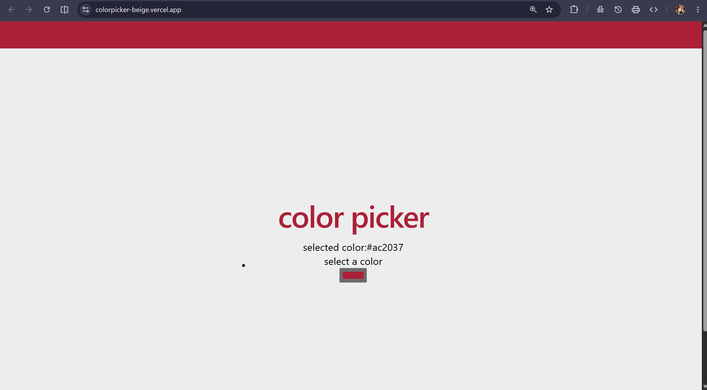

# 🎨 Color Picker App

A simple and interactive Color Picker application built using **React** and **Vite**. It allows users to choose any color using the browser's color input and instantly displays the selected color code while updating the page background.

## 🚀 Features

- 🎨 Pick any color using the color picker
- 🌈 Real-time background color update
- 🔢 Displays the selected HEX color code
- ⚡ Fast and lightweight with Vite
- 📱 Simple and responsive user interface

## 🛠️ Tech Stack

- React
- Vite
- JavaScript
- CSS

## 📂 Project Structure

```
color-picker/
├── public/
├── src/
│   ├── App.jsx
│   ├── main.jsx
│   ├── index.css
│   └── components/
├── package.json
├── vite.config.js
└── README.md
```

## 📸 Screenshot



> Save the screenshot as `screenshot.png` in the project root to display it in the README.

## ⚙️ Installation

1. Clone the repository

```bash
git clone <repository-url>
```

2. Navigate to the project directory

```bash
cd color-picker
```

3. Install dependencies

```bash
npm install
```

4. Start the development server

```bash
npm run dev
```

The application will run at:
https://colorpicker-beige.vercel.app/


## 📖 How to Use

1. Open the application in your browser.
2. Click the color picker input.
3. Select any color.
4. The background updates instantly, and the selected HEX color code is displayed on the screen.

## 🔮 Future Improvements

- Copy HEX color to clipboard
- Support RGB and HSL color formats
- Save favorite colors
- Add dark/light mode
- Display a color history
